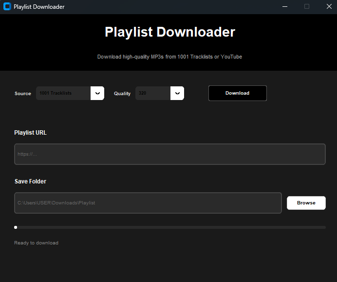

As a  DJ, you probably spend way too much time downloading your favourite songs from online playlists one by one. Rest assured! It's all here in this simple playlist downloader. Go mix!

# 1001-tracklists-crawler
## 0-Installation
Just download the latest release

## 1-Want to modify it yourself?
1 - Clone the git locally\
2 - Create and install a new conda env with:
`conda env create -f environment.yml`
3 - Activate and run
`conda activate playlist-downloader`

## 2-Usage guide
1 - Run scrapper_bot.py\
2 - In the GUI, copy paste the URL of the desired playlist to download in [1001 tracklists](https://www.1001tracklists.com/)\
3 - Enter folder name in which you want your mp3 files to be stored\
4 - Press run\
5 - Mix mix baby
